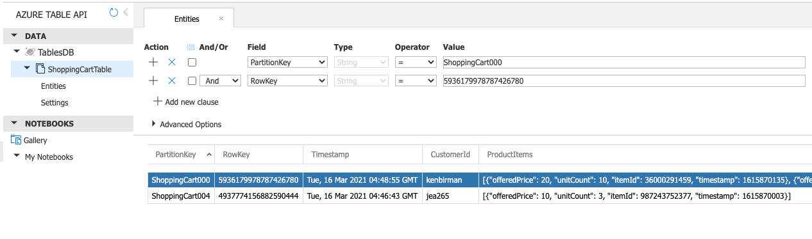
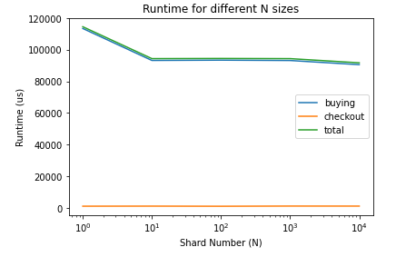
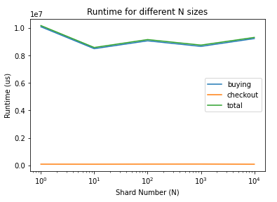
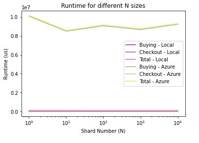

# Shopping Cart Service 🛒

Project Repo: https://github.com/juanesarango/cart-dht.git

The following service uses an implementation of an API using a sharded Ditributed Hash Table (DHT) in the backend.

This project uses 2 backends: A Local DHT and an Azure Cosmos DB Table. A simple configuration of `DB_TYPE=Azure` or `DB_TYPE=Local` switches the database used in the application:
## Content of the files

- The `db.py` is the connector between the api and the database backend. It has 2 main classes:
    - `ShoppingCartServiceLocal` if the local DHT is selected and
    - `ShoppingCartServiceCloud` if the azure backend is selected.

- The `dht.py` defines the local DHT. It has defined classes for the data backend:

  - `DHTServer`: each of the instances storing the customer's shopping carts as key-value pairs.
  - `DHTServerStore`: the array of DHTServes, that distrubutes the i/o data across the shards.

- The `api.py` the methods of the shopping cart to read/write the info into the sharded DHT, and has the main endpoint methods to respond to user interactions:

| Endpoint                      |  Method  |                          Body Data                           |           Description           |
| :---------------------------- | :------: | :----------------------------------------------------------: | :-----------------------------: |
| `/items/<customerId>`         |  `GET`   |                                                              |    List shopping Cart items     |
| `/item/<customerId>/<itemId>` |  `POST`  | `offeredPrice`, `itemCount`, `specialSale`, `saleExpiration` |     Add Item to Cart (Buy)      |
| `/item/<customerId>/<itemId>` |  `PUT`   |                          `newCount`                          |        Update item count        |
| `/item/<customerId>/<itemId>` | `DELETE` |                              ``                              |      Delete Item from Cart      |
| `/items/<customerId>`         | `DELETE` |                              ``                              | Delete Customer Cart (Checkout) |

- The `utils.py` have useful methods to hash, serialize and parse date objects. These operations are done before storing the data in the DHT. The DHT validates that the key is a 64-bit integer and that the value is a bytearray.

  - `hash_key()`: encodes the input string to byte, hashes with SHA1, outputs a HEX which in converted to base 10 and only takes module 2^63 to ensure hashed key it's a 64-bit integer.

  - `serialize_value()`: converts the input python object as json string, encodes to byte and outputs a byte array.

  - `deserialize_value()`: converts the input byte array back to a json string that can be loaded again as python object.

- The `tests/test_api.py`: contains tests with mockup data to test the main api methods, checking that items and cart are properly updated for each api method as expected. It runs both for the local DHT and the Azure backend.

- The `benchmark.py`: contains some tests of common cart opertions using different shard sizes, with time measurements.

## Azure Implementation
The backend is setup in a CosmosDb Table named `ShoppingCartTable`. Each record of the table is a shopping cart of a customer.
- The unique `RowKey` is a 64-bit integer converted to string of the customer_id, by using SHA1 to hash, converting to Hexadecimal and grabbing the 64 modulo.
- The `PartitionKey` of each shard is defined by the modulo of this 64-bit integer with the total of shards, which is a dynamic parameter that can be configured; prunning it to 3 digits and adding a Prefix `ShoppingCart`. For example, if the hash of the customer id is `5936179978787426786`, and the number of shards is 5, then the `PartitionKey` is `ShoppingCart001`.
- Each row of the table only stores 2 values besides the required fields and the timestamp:  `CustomerId` and `ProductItems`, that are the unhashed `customerId` and the whole list of Items as a string.



## Setup and Running

To access Azure, you need to export the required credentials, as environmental variables. You can export them or store them in an `.env` file:
```bash
# .env

# For Flask in production
export FLASK_SECRET_KEY=<flask-secret-key>

# To use Azure
export AZURE_COSMOS_CONNECTION_STRING=<connection-string>
export DB_TYPE=Azure
```

To install and execute the application:
```bash
# Install dependencies
pip install -r requirements.txt

# Run the api server
export FLASK_APP=cart.api
export FLASK_ENV=development
flask run
```

## Run Tests

Run tests with mockup data for main endpoints.
```bash
pytest tests -s
```

WIth `DB_TYPE=Azure`, tests run using Azure CosmosDb, else it uses the local DHT:

```bash
DB_TYPE=Local pytest tests -s
DB_TYPE=Azure pytest tests -s
```
## Benchmark

A benchmark was done using `test/benchmark.py`, to test common cart opertions using different shard sizes. A run can be done by running:

### Running Local DHT:
```bash
DB_TYPE=Local python benchmark.py
```

These are the results of one run:

| Shard Size (N) | Time to Add 100 products (us) | Time to checkout 100 products (us) | Total Time to add and checkout 100 products |
| :------------- | :---------------------------: | :--------------------------------: | :-----------------------------------------: |
| 1              |             95619             |                1067                |                    96686                    |
| 10             |             94262             |                1053                |                    95315                    |
| 100            |             94381             |                1151                |                    95532                    |
| 1000           |             92164             |                1062                |                    93226                    |
| 10000          |             91372             |                1226                |                    92598                    |



### Running in Azure:
```bash
DB_TYPE=Azure python benchmark.py
```

These are the results of one run:
| Shard Size (N) | Time to Add 100 products (us) | Time to checkout 100 products (us) | Total Time to add and checkout 100 products |
| :------------- | :---------------------------: | :--------------------------------: | :-----------------------------------------: |
| 1   | 9904628    | 83725   | 9988353 |
| 10  | 9203126   | 79411  | 9282537 |
| 100 | 8610234  | 81568 | 8691802 |
| 1000    | 7948652 | 89714    | 8038366 |
| 10000   | 8079101    | 80263   | 8159364 |




### Plotting both

Running on 1000 runs and getting the average. The runtimes seem to be pretty constant even when DHT shards grow in several orders of magnitude. Azure is almost 10X slower, this can be expect as the backend is remote, there's some transfer latency and because the plan in Azure is Serverless with probably not a lot of throughput for the Student accounts.


