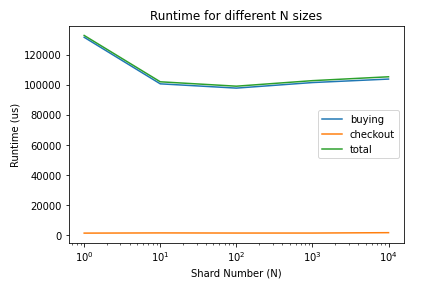

# Shopping Cart Service 🛒

The following service uses an implementation of an API using a sharded Ditributed Hash Table (DHT) in the backend.

## Content of the files

- The `store.py` has defined classes for the data backend:

  - `DHTServer`: each of the instances storing the customer's shopping carts as key-value pairs.
  - `DHTServerStore`: the array of DHTServes, that distrubutes the i/o data across the shards.

- The `api.py` the methods of the shopping cart to read/write the info into the sharded DHT, and has the main endpoint methods to respond to user interactions:

| Endpoint                      |  Method  |                          Body Data                           |           Description           |
| :---------------------------- | :------: | :----------------------------------------------------------: | :-----------------------------: |
| `/items/<customerId>`         |  `GET`   |                                                              |    List shopping Cart items     |
| `/item/<customerId>/<itemId>` |  `POST`  | `offeredPrice`, `itemCount`, `specialSale`, `saleExpiration` |     Add Item to Cart (Buy)      |
| `/item/<customerId>/<itemId>` |  `PUT`   |                          `newCount`                          |        Update item count        |
| `/item/<customerId>/<itemId>` | `DELETE` |                              ``                              |      Delete Item from Cart      |
| `/items/<customerId>`         | `DELETE` |                              ``                              | Delete Customer Cart (Checkout) |

- The `utils.py` have useful methods to hash, serialize and parse date objects. These operations are done before storing the data in the DHT. The DHT validates that the key is a 64-bit integer and that the value is a bytearray.

  - `hash_key()`: encodes the input string to byte, hashes with SHA1, outputs a HEX which in converted to base 10 and only takes module 2^63 to ensure hashed key it's a 64-bit integer.

  - `serialize_value()`: converts the input python object as json string, encodes to byte and outputs a byte array.

  - `deserialize_value()`: converts the input byte array back to a json string that can be loaded again as python object.

- The `tests/test_api.py`: contains tests with mockup data to test the main api methods, checking that items and cart are properly updated for each api method as expected.

- The `benchmark.py`: contains some tests of common cart opertions using different shard sizes, with time measurements.

## Setup

```bash
# Install dependencies
pip install -r requirements.txt

# Run the api server
export FLASK_APP=cart.api
export FLASK_ENV=development
flask run
```

## Run Tests

Run tests with mockup data for main endpoints.

```bash
pytest tests
```

## Benchmark

A benchmark was done using `test/benchmark.py`, to test common cart opertions using different shard sizes. A run can be done by running:

```bash
python benchmark.py
```

These are the results of one run:

| Shard Size (N) | Time to Add 100 products (us) | Time to checkout 100 products (us) | Total Time to add and checkout 100 products |
| :------------- | :---------------------------: | :--------------------------------: | :-----------------------------------------: |
| 1              |             95619             |                1067                |                    96686                    |
| 10             |             94262             |                1053                |                    95315                    |
| 100            |             94381             |                1151                |                    95532                    |
| 1000           |             92164             |                1062                |                    93226                    |
| 10000          |             91372             |                1226                |                    92598                    |

Running on 1000 runs and getting the average. The runtimes seem to be pretty constant even when DHT shards grow in magnitude.



# Run Client-Server using gRPC

Build from proto file:

```bash
python -m grpc_tools.protoc \
    --proto_path=. \
    --python_out=. \
    --grpc_python_out=. \
    cart.proto
```

# Tests

Run DHT servers:

```bash
python grpc/cart_server.py
```

Run API client:

```bash
python grpc/cart_client.py
```

# Tests

Run DHT servers:

```bash
python cart_grpc/cart_dht_server.py
```

Run API client:

```bash
export FLASK_APP=cart_grpc.cart_api_client
export FLASK_ENV=development
flask run --port 5500
```

Query Examples:

```bash
curl -X GET -H 'Content-Type: application/json'  http://127.0.0.1:5500/items/jea-265

curl -X POST -H 'Content-Type: application/json' -d '{"unitCount": 6, "offeredPrice": 50}' http://127.0.0.1:5500/items/jea-265/036000291459
```
